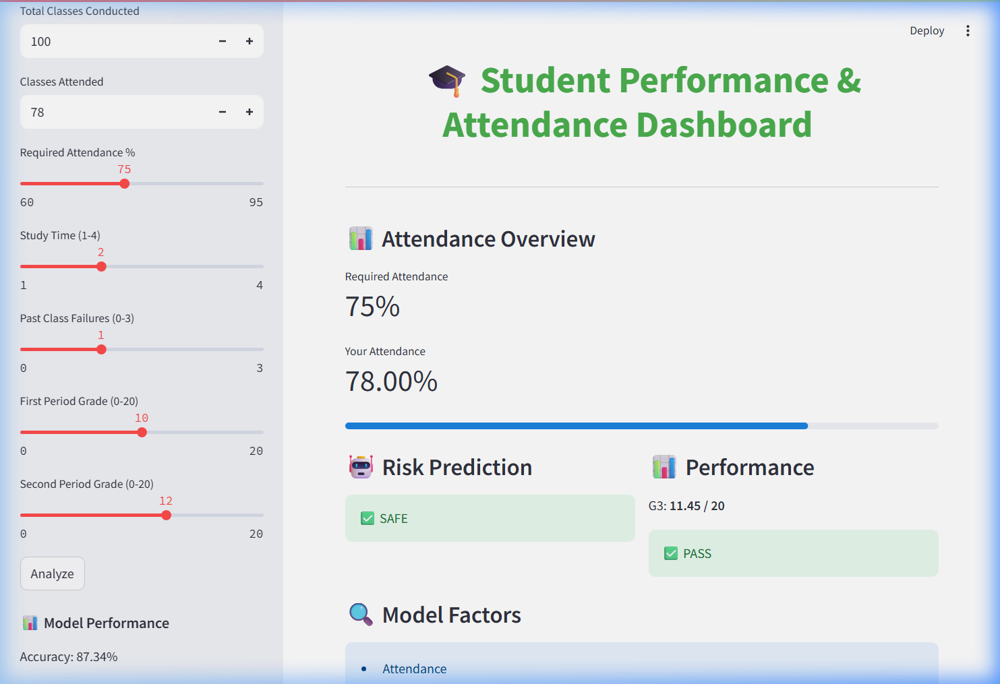
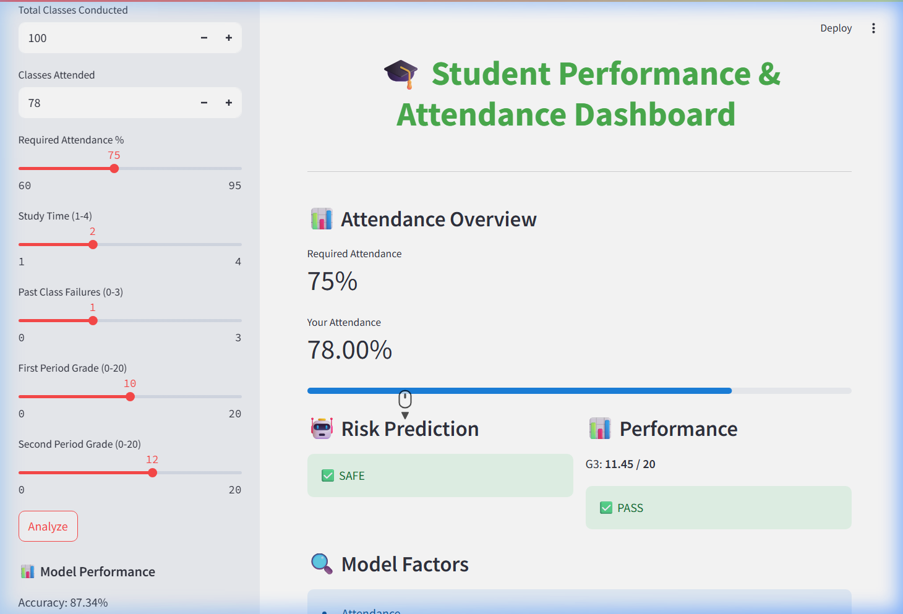
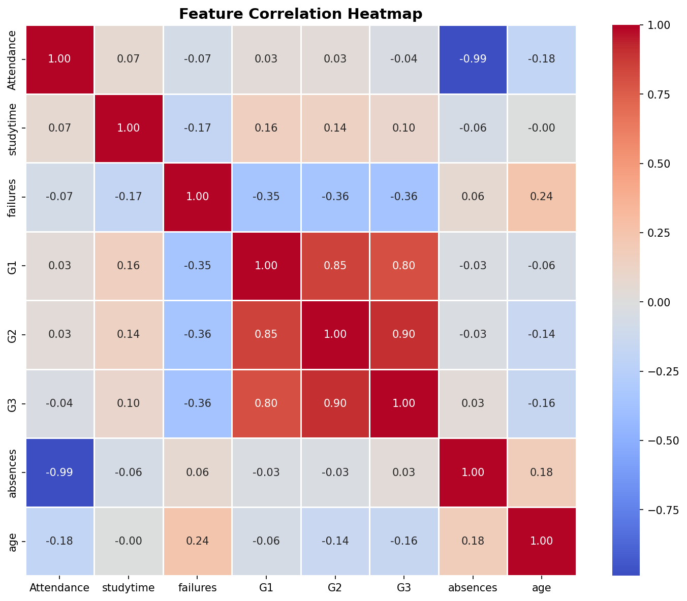
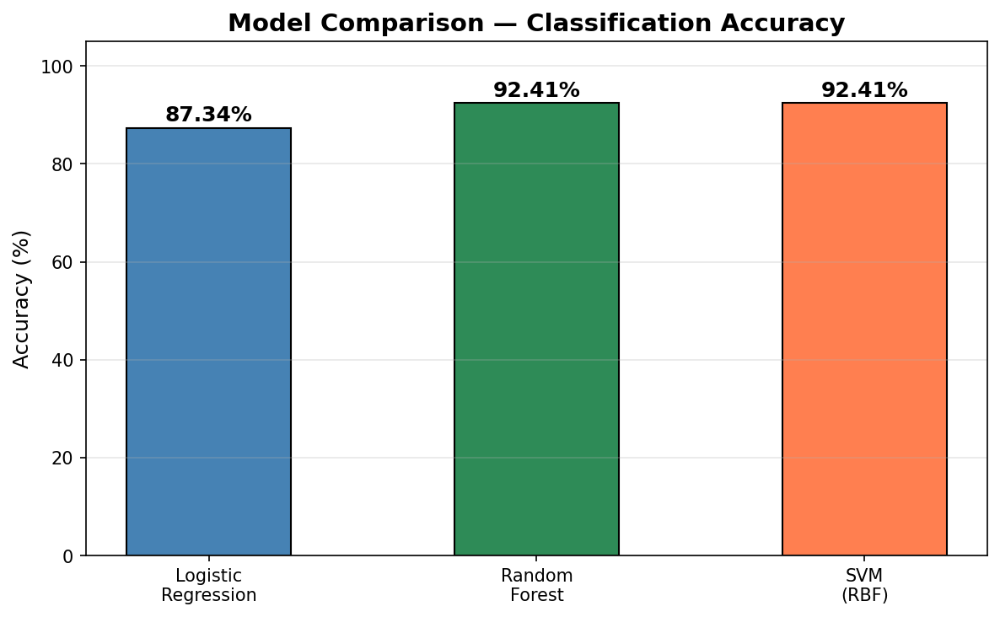
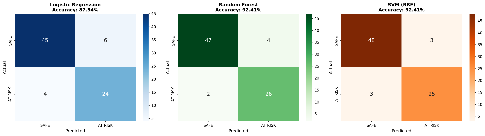

# 🎓 Student Performance & Attendance Prediction Using Machine Learning


A Machine Learning-based system that predicts student academic risk and final performance using attendance and academic data. Features an interactive **Streamlit dashboard** with a Smart Bunk Calculator.

---

## 🔍 Problem Statement

Students often don't realize they're at academic risk until it's too late. This project provides **early identification** of at-risk students by analyzing attendance patterns, study habits, past failures, and internal assessment scores — enabling timely intervention by educators.

---

## 🚀 Features

- **Risk Classification** — Predicts if a student is **SAFE** or **AT RISK** using Logistic Regression (87.34% accuracy)
- **Grade Prediction** — Estimates the final grade (G3) on a 0–20 scale using Linear Regression (R² ≈ 0.82)
- **Model Comparison** — Evaluates Logistic Regression vs Random Forest (92.41%) vs SVM (92.41%)
- **Smart Bunk Calculator** — Tells students how many classes they can safely skip
- **Interactive Dashboard** — Built with Streamlit for real-time predictions
- **EDA & Visualizations** — Correlation heatmap, confusion matrices, grade distributions, and more

---

## 📊 Dataset

| Detail | Value |
|--------|-------|
| **Source** | [UCI Machine Learning Repository — Student Performance](https://archive.ics.uci.edu/ml/datasets/student+performance) |
| **Records** | 395 students |
| **Features** | 33 attributes |
| **Subject** | Mathematics |

---

## 🛠️ Tech Stack

| Technology | Purpose |
|------------|---------|
| **Python** | Programming Language |
| **Pandas & NumPy** | Data Processing |
| **Scikit-learn** | ML Models & Evaluation |
| **Matplotlib & Seaborn** | Visualizations |
| **Streamlit** | Interactive Web Dashboard |

---

## 📈 Models & Results

| Model | Task | Accuracy |
|-------|------|----------|
| Logistic Regression | Risk Classification | **87.34%** |
| Random Forest | Risk Classification | **92.41%** |
| SVM (RBF) | Risk Classification | **92.41%** |
| Linear Regression | Grade Prediction | **R² ≈ 0.82** |

### Evaluation Metrics Used
- Confusion Matrix
- Classification Report (Precision, Recall, F1-Score)
- R² Score, MAE, RMSE

---

## 🖥️ Screenshots

### Streamlit Dashboard


### Risk Prediction & Performance


### Correlation Heatmap


### Model Comparison


### Confusion Matrices


---

## ⚡ Quick Start

### 1. Clone the repository
```bash
git clone https://github.com/YOUR_USERNAME/student-performance-prediction.git
cd student-performance-prediction
```

### 2. Install dependencies
```bash
pip install -r requirements.txt
```

### 3. Run the Streamlit Dashboard
```bash
streamlit run app.py
```

### 4. Run the Jupyter Notebook
```bash
jupyter notebook student_ml_project.ipynb
```

---

## 📁 Project Structure

```
├── app.py                      # Streamlit dashboard application
├── student_ml_project.ipynb    # Jupyter notebook (EDA + Model Training)
├── student-mat.csv             # UCI Student Performance dataset
├── screenshots/                # Application & visualization screenshots
├── requirements.txt            # Python dependencies
└── README.md                   # This file
```

---

## 🔮 Future Improvements

- Cross-validation for more robust evaluation
- Advanced models (XGBoost, Gradient Boosting)
- Real-world attendance tracking integration
- SMS/Email notifications for at-risk students
- Deployment on Streamlit Cloud

---

## 📜 License

This project is licensed under the MIT License.

---

## 🤝 Contributing

Contributions, issues, and feature requests are welcome! Feel free to open an issue or submit a pull request.

---

⭐ **If you found this project useful, give it a star!**
